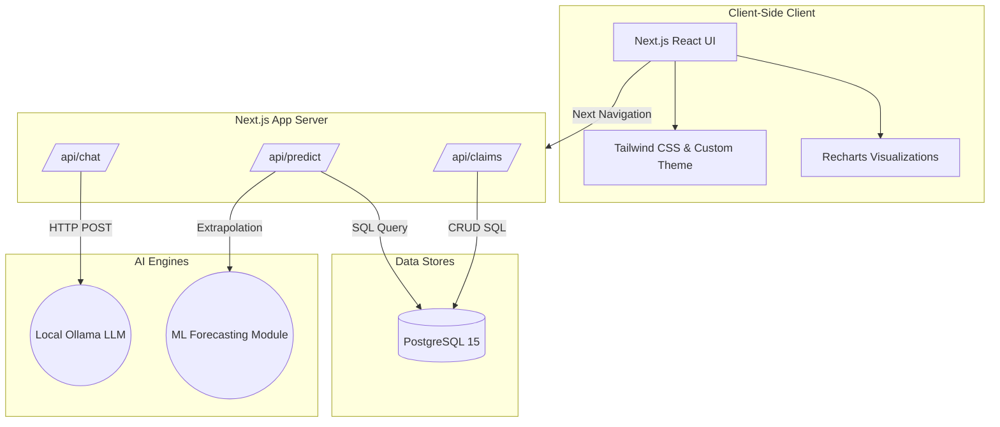

<div align="center">
  
  <h1>HelixFlow AI</h1>
  <p><strong>The Operating System for Healthcare Administration</strong></p>
  <p>Build a production-grade, multi-tenant SaaS platform for healthcare workflow automation that sits securely between providers and payers.</p>
</div>

<br />

## 🌟 Overview
HelixFlow AI is an advanced administrative automation platform targeting the $400B+ healthcare administrative sector. By combining deep clinical NLP, multi-agent reasoning, knowledge graphs, and digital twin simulations, HelixFlow actively predicts denials, accelerates prior authorizations, and uncovers revenue leakage before it disrupts hospital operations.

Features like the **Low-Code Rules Engine**, **Integrations Hub** (for EHRs & Clearinghouses), and the **Developer Marketplace** make it simple for domain experts to manage complex, end-to-end automation workflows securely out-of-the-box.

---

## 🚀 Core Features & Dashboards

### 🛡️ Authorization Command Center
Track all pending prior authorizations in one place. Using our mock **Clinical NLP + Policy Reasoning LLM**, the platform assesses patient data against requirements to provide real-time approval probabilities, highlighting documentation gaps.

### 📄 Claims Intelligence Hub
A proactive claims engine. Validate CPT/ICD coding against coverage rules prior to submission. High-risk claims are flagged with AI-identified issues, reducing denial rates and minimizing recovery overhead.

### 💰 Revenue Cycle Dashboard
A unified financial view utilizing `Recharts` for dynamic data visualization. Track Total Revenue vs. AI-Prevented Revenue Leakage, First-Pass Yields, and Accounts Receivable Aging.

### 🧠 Payer Policy Explorer
An interactive mock interface into a **Neo4j Knowledge Graph**. It links Diagnosis Codes, Procedure Codes, and specific Payer Policies (e.g., BlueCross MRI conservative therapy rules) so coders accurately understand prerequisites visually.

### 🏥 Hospital Operations Twin
A digital simulation of hospital flow leveraging ML predictive models extrapolated from database history. Visually monitors ED Wait Times, ICU Capacities, and predicts surges up to 14 days in the future to aid in operational recommendations.

### 🤖 AI Copilot Console
A conversational interface powered locally by **Ollama**. Users can query complex CPT coding scenarios, request guidelines directly from the knowledge graph context, or draft medical necessity appeals securely and privately on their local machine.

---

## 🛠️ Advanced Platform Capabilities

### 🔌 Integrations Hub
Easily connect and manage integrations across the healthcare ecosystem. Designed with FHIR R4 and EDI/X12 standards in mind. Toggles provide native connections to:
- **EHR Providers**: Epic, Oracle Cerner, Athenahealth
- **Payers**: BlueCross BlueShield, UnitedHealthcare
- **Clearinghouses**: Availity, Change Healthcare

### ⚙️ Rules Engine (Low-Code)
Domain experts can embed business rationale over AI recommendations without writing code. Use the visual builder to establish conditionals such as:
> `IF [Claim Amount] < $250` AND `[AI Confidence] > 90%` `THEN [Auto-Submit to Payer]`

### 💻 Developer Portal & App Marketplace
A dedicated area for creating robust, extensible healthcare applications.
- **API Keys**: Manage production OAuth/API credentials securely.
- **Webhooks**: Register HTTPS callbacks for real-time claim/authorization decisions (e.g., `claim.approved`).
- **Marketplace**: Publish or install domain-specific AI agents such as the `Smart Coding Mapper` or the `Clinical Denial Recovery Agent`.

---

## 🏗️ Architecture Stack

- **Experience Layer**: Next.js 16 (App Router), React, TypeScript, Tailwind CSS, Shadcn UI, Recharts, Lucide Icons
- **Data Layer**: PostgreSQL 15, Faker.js (Synthetic Time-Series Seeding)
- **API Layer**: Next.js Serverless Routes (`/api/predict`, `/api/chat`)
- **AI/ML Integration**: Local Ollama (`gemma3` model) & local simulated ML regression APIs
- **Containerization**: Docker & Docker Compose

### System Architecture Diagram


### Database Schemas Included
The repository contains robust SQL definitions for:
`Tenants`, `Users`, `Patients`, `Prior Authorizations`, `Claims`, and `Denials`.

---

### Prerequisites
- [Docker](https://docs.docker.com/get-docker/) & Docker Compose installed.
- (Optional) Local [Ollama](https://ollama.com) installed if running the LLM natively on a Mac GPU instead of within Docker.

### 1. Clone & Setup
```bash
git clone https://github.com/jai2033shankar/healthx.git
cd healthx
```

### 2. Full Architecture Docker Run (One-Click)
We have containerized the entire Next.js Application and PostgreSQL database into a single `docker-compose` footprint.

Simply run:
```bash
docker-compose up --build -d
```
*This will:*
1. Build the Next.js `standalone` production server.
2. Spin up a PostgreSQL 15 container mapped to port `5433`.
3. Auto-initialize the `/db/schema.sql` database tables.
4. Expose the web application on port `3000`.

### 3. Seed the Database
To view the AI projections, generate synthetic hospital data:
```bash
npm install # if not installed locally
npx tsx scripts/seed_synthetic_data.ts
```

### 4. Access the Application
Navigate to [http://localhost:3000](http://localhost:3000) to view HelixFlow AI. Explore the `Hospital Twin` and `Revenue Cycle` tabs for predictive modeling.

### 5. Run the End-to-End Demo
To present this application showcasing the integrations to a wider audience, follow the highly detailed **[End-to-End Demo Script](./demo_script.md)**.

---

## 🛡️ Security & Compliance
*(Note: Current state is a frontend/schema skeleton for demonstration)*
When advancing to production, HelixFlow AI architecture plans for:
- HIPAA / SOC2 / HITECH Compliance
- SMART on FHIR scopes & OAuth2 via Keycloak
- TLS 1.3 / AES-256 Encryption
- Immutable Audit Logs for all continuous AI agent reasoning

---

> Built with precision for the modern healthcare enterprise.
